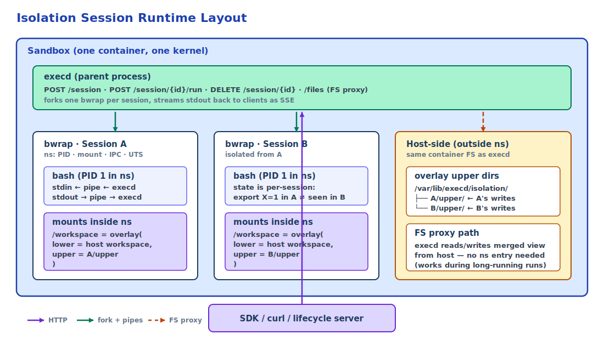
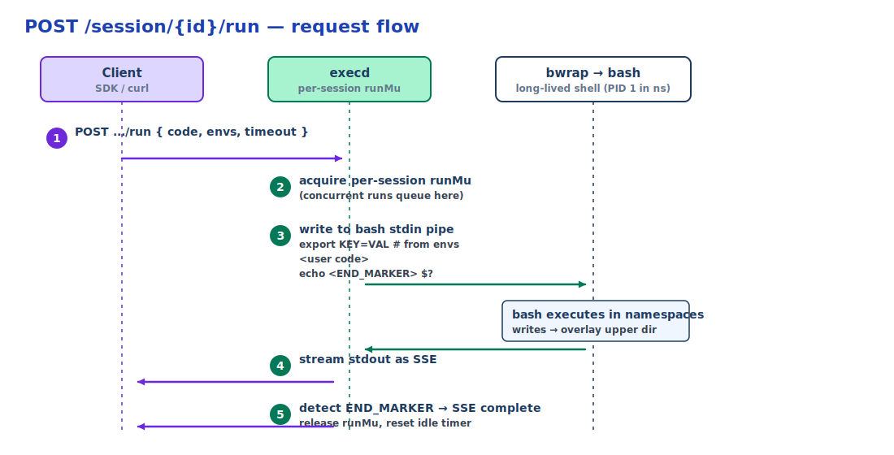

# Isolation Sessions

Isolation sessions run a **long-lived `bash` inside a
[bubblewrap](https://github.com/containers/bubblewrap) namespace**, so one
sandbox pod can host many mutually isolated task runs without spinning up a
new container. Each session gets its own PID, mount, tmpfs, and env
namespaces; startup is sub-millisecond.

## Table of Contents

- [Requirements](#requirements)
- [Overview](#overview)
- [How It Works](#how-it-works)
- [Quick Start](#quick-start)
- [Session Lifecycle](#session-lifecycle)
- [Workspace Modes](#workspace-modes)
- [Bind Mounts and Allowlist](#bind-mounts-and-allowlist)
- [Profiles and Defaults](#profiles-and-defaults)
- [Environment, UID, and Networking](#environment-uid-and-networking)
- [Filesystem Proxy](#filesystem-proxy)
- [Capabilities and Probing](#capabilities-and-probing)
- [Server Configuration](#server-configuration)
- [Limitations](#limitations)
- [See Also](#see-also)

---

## Requirements

Component versions needed for the features covered by this guide:

- `execd` >= 1.0.20 for base isolation session support; **>= 1.0.21
  recommended** for `binds`, `List sessions`, `uid_mode: "userns"`, and the
  default writable allowlist (`/workspace`, `/mnt`, `/media`, `/data`)
- `opensandbox-server` >= 0.2.1 — the server injects `CAP_SYS_ADMIN`,
  `apparmor=unconfined`, and the tmpfs mount required by `bwrap` when the
  execd image declares `bootstrap.execd.isolation`
- Python SDK >= 0.1.14 (`isolation.run_once` / `isolation.session` context
  manager); >= 0.1.13 for the generated isolation client only
- JavaScript / TypeScript SDK >= 0.1.10 (`isolation.runOnce` /
  `isolation.withSession`)
- Kotlin / Java SDK >= 1.0.16 (`isolation.runOnce()` /
  `isolation.withSession { ... }`); >= 1.0.15 for the generated isolation
  client only
- C# SDK >= 0.1.4 (`RunOnceAsync` / `WithSessionAsync`)
- Go SDK >= 1.0.4 (`IsolationRunOnce` / `IsolationWithSession`)

The `setpriv_available` / `userns_available` fields on
[`/capabilities`](#capabilities-and-probing) were added after execd v1.0.21
and are only present on execd builds from `main` at the time of writing;
older execd omits both fields (clients must tolerate their absence).

Host requirements (`bwrap` binary, `CAP_SYS_ADMIN`, `overlayfs`, etc.) are
listed under [Server Configuration → Host Requirements](#server-configuration).

---

## Overview

| Concept | Boundary | Startup | Typical Use |
|---|---|---|---|
| **Isolation session** | bubblewrap namespaces inside one sandbox | ~100 ms to create; subsequent `run` in an existing session is near-zero overhead | Many short, mutually isolated task runs reusing one long-lived session |
| Bash session (`/session`) | bash process, no extra namespaces | ms | Interactive REPL-style command sequences |
| Sandbox | container or pod | 100s of ms to seconds | Tenant, workspace, or user boundary |
| Secure runtime (gVisor / Kata) | user-space kernel or VM per sandbox | 10–500 ms | Hardware-level protection against container escape |

::: info Session creation vs. per-run cost
Creating a session takes about 100 ms because execd waits briefly after
starting `bwrap` to detect an immediately-exiting child. Once the session
exists, each `POST /run` reuses the same bash process, so per-run overhead
is negligible. Design workloads that amortize the create cost across many
`run` calls in one session.
:::

Good fits: **RL rollouts**, **batch code grading**, **multi-tool agent
runs** — one sandbox per worker, many isolated tasks inside.

Not a fit: cross-language kernels (use `/code`), interactive REPLs (use
`/session`), or hard trust boundaries against kernel exploits (use gVisor /
Kata; see [Secure Container Runtime](/guides/secure-container)).

---

## How It Works

`execd` forks one `bwrap` child per session; `bwrap` sets up Linux
namespaces, then `exec`s a long-lived `bash` inside them.



Two things the diagram doesn't show:

- `bash` is long-lived, so `export X=1` in one `run` is visible to the next
  `run` **in the same session** (never in another session).
- The FS proxy reads and writes the merged workspace view from **outside**
  the namespace, so uploads and downloads work while `bash` is busy.

### `run` request flow



Non-happy paths:

| Event | What happens |
|---|---|
| Run `timeout_seconds` elapsed | execd cancels the run context, which sends `SIGINT` to the bwrap process group and emits an `IsolatedError` SSE event; the session itself stays alive. |
| `bwrap` process exited | The next `run` returns an `IsolatedError` SSE event with `session process has exited`; only `ErrContextNotFound` (session ID unknown) becomes an HTTP-level error. `DELETE` + recreate. |
| Idle timeout reached | GC runs the same teardown as `DELETE`. |
| Client disconnects mid-SSE | The Gin request context is cancelled and execd sends `SIGINT` to the running command; the run does **not** continue in the background. |

---

## Quick Start

### curl

```bash
# Probe.
curl -s http://localhost:44772/v1/isolated/capabilities

# Create.
SESSION=$(curl -s -X POST http://localhost:44772/v1/isolated/session \
  -H "Content-Type: application/json" \
  -d '{
    "profile": "strict",
    "workspace": {"path": "/workspace", "mode": "overlay"},
    "idle_timeout_seconds": 300
  }' | jq -r .session_id)

# Run (SSE: stdout / error / complete).
curl -N -X POST "http://localhost:44772/v1/isolated/session/$SESSION/run" \
  -H "Content-Type: application/json" \
  -d '{"code": "export X=1; echo $X", "timeout_seconds": 30}'

# Second run reuses shell state.
curl -N -X POST "http://localhost:44772/v1/isolated/session/$SESSION/run" \
  -H "Content-Type: application/json" \
  -d '{"code": "echo $X"}'  # prints 1

# Delete.
curl -X DELETE "http://localhost:44772/v1/isolated/session/$SESSION"
```

### Python SDK

```python
from opensandbox import Sandbox
from opensandbox.models.isolated import (
    CreateIsolatedSessionRequest, IsolatedWorkspaceSpec, IsolatedRunOpts,
)

# Sandbox.create is an async classmethod, so await it before entering
# the async context manager.
async with (await Sandbox.create("python:3.11")) as sandbox:
    # One-shot.
    await sandbox.isolation.run_once(
        "python -c 'print(42)'", workspace="/workspace", profile="strict",
    )

    # Persistent session.
    async with sandbox.isolation.session(
        CreateIsolatedSessionRequest(
            workspace=IsolatedWorkspaceSpec(path="/workspace", mode="overlay"),
            profile="strict",
            idle_timeout_seconds=300,
        )
    ) as session:
        await session.run("export STAGE=train")
        await session.run("python train.py", opts=IsolatedRunOpts(timeout_seconds=600))
        await session.files.write_file("/workspace/data.csv", data_bytes)

    # Reattach after a client restart.
    handle = await sandbox.isolation.attach(known_session_id)
```

### JavaScript / TypeScript SDK

```ts
await sandbox.isolation.runOnce("node -e 'console.log(1)'", "/workspace", {
  profile: "strict",
});

await sandbox.isolation.withSession(
  { profile: "strict", workspace: { path: "/workspace", mode: "overlay" } },
  async (session) => { await session.run("npm test"); },
);
```

### Kotlin SDK

```kotlin
sandbox.isolation().runOnce(code = "python -c 'print(1)'", workspace = "/workspace")

sandbox.isolation().withSession(request) { session ->
    session.run("ls /workspace")
}
```

---

## Session Lifecycle

Under `/v1/isolated/` on execd. Use `X-EXECD-ACCESS-TOKEN` when execd has
an access token configured.

| Method | Path | Purpose |
|---|---|---|
| `POST` | `/session` | Create; returns `{session_id, created_at}`. |
| `GET` | `/sessions` | List active sessions. |
| `GET` | `/session/{id}` | Full state; echoes creation params so a stateless client can rebuild the handle. |
| `POST` | `/session/{id}/run` | SSE stream: `stdout` / `error` / `complete`. Runs on the same session are serialized. |
| `DELETE` | `/session/{id}` | Destroy. |
| `GET` | `/capabilities` | Probe. |

`idle_timeout_seconds > 0` destroys idle sessions automatically; set to `0`
to disable idle GC and always `DELETE` explicitly.

---

## Workspace Modes

| Mode | Semantics |
|---|---|
| `rw` | Bind-mount read-write; writes persist on the host. |
| `overlay` (default) | Copy-on-write via overlayfs; writes go to a per-session upper dir and vanish on `DELETE`. |
| `ro` | Bind-mount read-only; writes fail with `EROFS`. |

Overlay upper dirs live under `upper_root` (default `/var/lib/execd/isolation`).

```json
{ "workspace": { "path": "/workspace", "mode": "overlay" } }
```

---

## Bind Mounts and Allowlist

- **`extra_writable`** — paths bind-mounted read-write at the same path
  (`source == destination`).
- **`binds`** — explicit `source` → `dest` mappings, optionally `readonly`.
  `source` must already exist; `dest` must already exist inside the
  namespace (bake it into the sandbox image).

```json
{
  "workspace": { "path": "/workspace", "mode": "rw" },
  "extra_writable": ["/data/scratch"],
  "binds": [
    { "source": "/data/in",  "dest": "/mnt/in",  "readonly": true },
    { "source": "/data/out", "dest": "/mnt/out" }
  ]
}
```

Every `source` is checked against the operator-configured `allowed_writable`
allowlist **after** symlink resolution, so symlinks cannot escape it. Default
allowlist: `/workspace`, `/mnt`, `/media`, `/data` (subpaths allowed). Empty
allowlist rejects all extra binds.

---

## Profiles and Defaults

The `profile` field currently controls only how `/tmp` is exposed inside the
namespace:

| Profile | `/tmp` |
|---|---|
| `strict` (default) | Private tmpfs (`--tmpfs /tmp`) |
| `balanced` | Shared with the sandbox (`--bind /tmp /tmp`) |

`workspace.mode` and `env_passthrough` are **independent** of the profile:
when they are omitted, execd normalizes `workspace.mode` to `overlay` and
`env_passthrough.mode` to `deny` regardless of which profile you pick. Set
those fields explicitly if you want persistent workspace writes (`"rw"`) or
host env passthrough (`"allow"`).

---

## Environment, UID, and Networking

- **`env_passthrough`** — `mode: "allow"` + `keys` whitelists host env vars;
  default `deny`. Per-run overrides go in `IsolatedRunRequest.envs`.
- **`uid` / `gid`** with **`uid_mode: "setpriv"`** (default, real
  setuid/setgid drop) or **`"userns"`** (user namespace remap). Check
  `setpriv_available` / `userns_available` from
  [`/capabilities`](#capabilities-and-probing) before requesting a mode.
- **`share_net: true`** shares the sandbox's network namespace. Sandbox-level
  egress and Credential Vault policies still apply.

---

## Filesystem Proxy

Reads and writes the session's **merged** workspace view from outside the
namespace — this is how SDKs `upload`, `download`, and `list` without
spawning a shell. All paths are per session under
`/v1/isolated/session/{id}/`:

| Method | Path |
|---|---|
| `GET` | `files/info?path=...` |
| `GET` | `files/download?path=...` (supports `Range` and `offset`/`limit`) |
| `POST` | `files/upload` (multipart: `metadata` + `file`) |
| `DELETE` | `files?path=...` |
| `POST` | `files/mv` |
| `POST` | `files/permissions` |
| `POST` | `files/replace?verbose=true` |
| `GET` | `files/search?path=...&pattern=...` |
| `GET` | `directories/list?path=...&depth=N` |
| `POST` | `directories` |
| `DELETE` | `directories?path=...` |

Writes on a `ro` workspace fail; writes on `overlay` land in the upper dir
and vanish on `DELETE`.

---

## Capabilities and Probing

```bash
curl -s http://localhost:44772/v1/isolated/capabilities
```

```json
{
  "available": true,
  "isolator": "bwrap",
  "version": "0.9.0",
  "setpriv_available": true,
  "userns_available": false,
  "commit_supported": false,
  "diff_supported": false
}
```

- `available: false` — bubblewrap is missing or the host can't create the
  required namespaces (missing `CAP_SYS_ADMIN`, restricted user-ns sysctl, etc.).
- `setpriv_available` / `userns_available` — whether sessions with
  `uid_mode: "setpriv"` or `"userns"` can be created. `setpriv_available`
  reflects only execd's **default** UID/GID; a session that requests a
  different UID/GID may still return `503 NOT_SUPPORTED` when identity
  switching is unavailable.
- `commit_supported` / `diff_supported` — Phase 2 stubs, currently return `503`.

---

## Server Configuration

Point execd at an optional TOML file:

| Flag | Env |
|---|---|
| `--isolation-config` | `EXECD_ISOLATION_CONFIG` |

```toml
# Parent directory for per-session overlay upper dirs.
upper_root = "/var/lib/execd/isolation"

# Hard limit on total upper directory size across all sessions (bytes).
# Default: 8 GiB. Set to 0 only if you want to disable the quota entirely.
upper_max_bytes = 8589934592  # 8 GiB

# Sources allowed for extra_writable / binds (symlink-resolved).
# Default: ["/workspace", "/mnt", "/media", "/data"]. Empty = reject all.
allowed_writable = ["/workspace", "/mnt", "/media", "/data"]
```

Example: `components/execd/configs/isolation.example.toml`.

**Host requirements:** `bwrap` binary in the execd image; `CAP_SYS_ADMIN`
(and `kernel.unprivileged_userns_clone=1` for `uid_mode: "userns"`);
`overlayfs` in the kernel for `overlay` workspaces.

Note: `/capabilities` reports `available: false` only when bwrap itself
cannot be started at all (missing binary or missing namespace capabilities).
A missing `overlayfs` does **not** flip `available` — the overlay probe only
influences Phase 2 `commit`/`diff` support, and default overlay-mode session
creation can still fail at runtime on such hosts. If you rely on
`workspace.mode: "overlay"`, verify `overlayfs` support directly on the
host.

---

## Limitations

- **`diff` / `commit` are Phase 2 stubs**, currently return `503`. Tracked
  in [OSEP-0013](https://github.com/opensandbox-group/OpenSandbox/blob/main/oseps/0013-isolated-execution-api.md).
- **No hardware-level guarantee.** Namespaces + seccomp only; pair with a
  secure runtime for kernel-exploit defense.
- **Linux only.** Non-Linux builds return `available: false`.
- **Serialized runs per session** — create multiple sessions for parallelism.
- **Bind destinations must pre-exist** in the sandbox image.

---

## See Also

- [OSEP-0013 — Isolated Execution API](https://github.com/opensandbox-group/OpenSandbox/blob/main/oseps/0013-isolated-execution-api.md)
- [execd](/components/execd)
- [Secure Container Runtime](/guides/secure-container)
- [execd OpenAPI spec](/api/)
